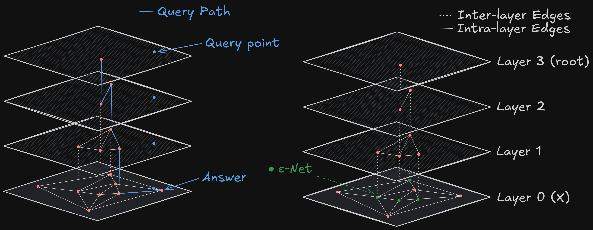

# 🐔 HENN

*A Hierarchical Epsilon Net Navigation Graph for Approximate Nearest Neighbor Search*

<p align="center">
  
</p>

## Overview

This repository builds on [hnswlib](https://github.com/nmslib/hnswlib) by introducing the `HENN` graph — a hierarchical structure using ε-nets for approximate nearest neighbor (ANN) search.

- Forked from [hnswlib](https://github.com/nmslib/hnswlib)
- Core implementation: [`hnswlib/henn.h`](hnswlib/henn.h)
- Example usage:
  - C++: `examples/cpp/henn`
  - Python: `examples/python/henn`
- To run examples, edit `CMakeLists.txt` to compile the desired targets.

## Build and Run

Follow the original [hnswlib build instructions](https://github.com/nmslib/hnswlib):

### C++ Build

```bash
mkdir build && cd build
cmake ..
make
```

### Python (bindings) Build
```bash
python setup.py install
```
